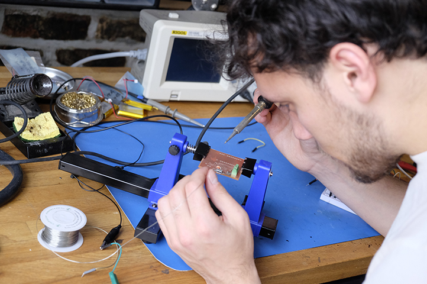

Hi! Thanks for visiting my website. Currently I teach afterschool coding and robotics at <a href="whedco.org">WHEDco</a>, mostly using the Scratch <a href="http://scratched.gse.harvard.edu/guide/index.html">Creative Computing Curriculum</a>, and I am also working on applying to graduate school. In 2016, I received my B.S. in Mechanical Engineering from Johns Hopkins Unviersity. Feel free to contact me at <a href="mailto:adrian@adrianpearl.com">adrian@adrianpearl.com</a>.
