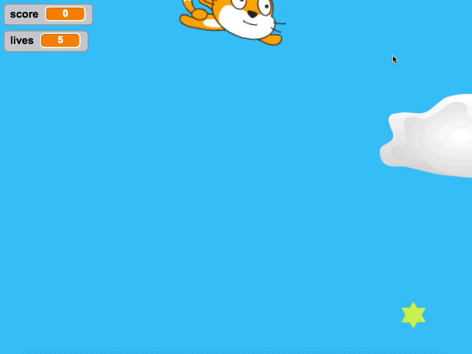

Text can be **bold**, _italic_, or ~~strikethrough~~.

[back](./).

There should be whitespace between paragraphs.

There should be whitespace between paragraphs. We recommend including a README, or a file with information about your project.

# [](#header-1)Header 1

This is a normal paragraph following a header. GitHub is a code hosting platform for version control and collaboration. It lets you and others work together on projects from anywhere.

## [](#header-2)Header 2

> This is a blockquote following a header.
>
> When something is important enough, you do it even if the odds are not in your favor.

### [](#header-3)Header 3

```js
// Javascript code with syntax highlighting.
var fun = function lang(l) {
  dateformat.i18n = require('./lang/' + l)
  return true;
}
```

```ruby
# Ruby code with syntax highlighting
GitHubPages::Dependencies.gems.each do |gem, version|
  s.add_dependency(gem, "= #{version}")
end
```

#### [](#header-4)Header 4

*   This is an unordered list following a header.
*   This is an unordered list following a header.
*   This is an unordered list following a header.

##### [](#header-5)Header 5

1.  This is an ordered list following a header.
2.  This is an ordered list following a header.
3.  This is an ordered list following a header.

###### [](#header-6)Header 6

| head1        | head two          | three |
|:-------------|:------------------|:------|
| ok           | good swedish fish | nice  |
| out of stock | good and plenty   | nice  |
| ok           | good `oreos`      | hmm   |
| ok           | good `zoute` drop | yumm  |

### There's a horizontal rule below this.

* * *

### Here is an unordered list:

*   Item foo
*   Item bar
*   Item baz
*   Item zip

### And an ordered list:

1.  Item one
1.  Item two
1.  Item three
1.  Item four

### And a nested list:

- level 1 item
  - level 2 item
  - level 2 item
    - level 3 item
    - level 3 item
- level 1 item
  - level 2 item
  - level 2 item
  - level 2 item
- level 1 item
  - level 2 item
  - level 2 item
- level 1 item

### Small image


### Large image


### Definition lists can be used with HTML syntax.

<dl>
<dt>Name</dt>
<dd>Godzilla</dd>
<dt>Born</dt>
<dd>1952</dd>
<dt>Birthplace</dt>
<dd>Japan</dd>
<dt>Color</dt>
<dd>Green</dd>
</dl>

```
Long, single-line code blocks should not wrap. They should horizontally scroll if they are too long. This line should be long enough to demonstrate this.
```

```
The final element.
```

<div class='photo-grid-container'>
  <div class='photo-grid'>

    <div class='photo-grid-item'>
        <figure>
        <div class="img-link"><a href="searchtaxdata"></a></div>
        <figcaption>SearchTaxData: a web app for exploring and visualizing the federal tax code</figcaption>
        </figure>
    </div>

    <div class='photo-grid-item'>
        <figure>
        <div class="img-link"><a href="scratch"></a></div>
        <figcaption>Scratch: teaching kids to program with simple video games</figcaption>
        </figure>
    </div>

	<div class='photo-grid-item'>
	  <figure>
	  <div class="img-link"><a href="koko"></a></div>
	  <figcaption>Koko: making long-distance digital communication a little more tactile</figcaption>
	  </figure>
	</div>

	<div class='photo-grid-item'>
	  <figure>
	  <div class="img-link"><a href="waycount"></a></div>
	  <figcaption>wayCOUNT: a platform created by Tomorrow Lab for collecting and sharing automobile traffic data</figcaption>
	  </figure>
	</div>

	<div class='photo-grid-item'>
	  <figure>
	  <div class="img-link"><a href="littledata"></a></div>
	  <figcaption>LittleData: a web-connected digital art and data display</figcaption>
	  </figure>
	</div>

	<div class='photo-grid-item'>
	  <figure>
	  <div class="img-link"><a href="jig"></a></div>
	  <figcaption>Custom-modified PCB programming jig created for a Tomorrow Lab client</figcaption>
	  </figure>
	</div>

	<div class='photo-grid-item'>
	  <figure>
	  <div class="img-link"><a href="koala"></a></div>
	  <figcaption>Koala: augmenting weight machines for automatic workout tracking</figcaption>
	  </figure>
	</div>

	<div class='photo-grid-item'>
	  <figure>
	  <div class="img-link"><a href="kryptonite"></a></div>
	  <figcaption>Senior design project: a smart bike lock designed with Kryptonite</figcaption>
	  </figure>
	</div>

  </div>
</div>