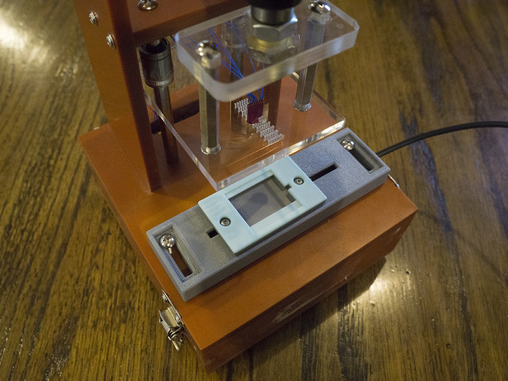
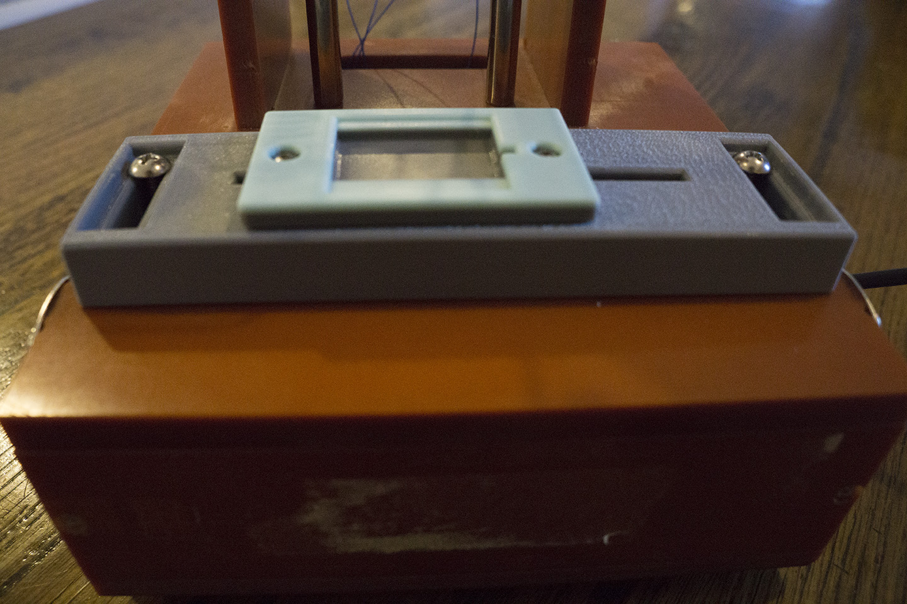

During my time at Tomorrow Lab, I got the chance to lead a short-term client-facing project for a client that had a bunch of PCBs they needed to reprogram. The exact scope of work was to build a jig fixture designed specifically for the PCB the client was using, establish the simplest-possible toolchain for programming, and flash the chip with firmware provided by the client and verify that the program had been flashed correctly. We had some old jigs lying around, so I took one and removed the parts specific to the prior work it was used for, leaving only the base structure and the vertical translation mechanism.

<figure>
	
</figure> 	

In my final design, a 3D-printed structure holds the PCB in place in the horizontal plane, and laser cut acrylic holds spring-loaded pogo pins that descend directly onto the board’s programming pads. With a focus on delivering a finished jig as quickly as possible, I took several measures to speed up development time and reduce the necessary number of iterations:

  

<ul>
	<li>By soldering wires to a second copy of the PCB and plugging it into a breadboard, I was able to work on setting up the programming toolchain in parallel with my work on building the jig.</li>
	<li>I didn’t have access to an in-house laser cutter whose tolerances and kerf I could find precise information on. Instead of cutting holes into several pieces of acrylic in a guess-and-check fashion, I had a single piece of acrylic cut with several rows of holes, sized incrementally so that one of them would fit the pogo pins.</li>
	<li>Since I didn’t know beforehand which row of holes would be the right one, I needed a way to adjust the location of the PCB on the fly. My solution was a 2-tiered mechanism that allowed for spatial adjustment in both horizontal dimensions. When the optimal locations were found that lined the pogo pins up with their points of contact on the PCB, the mechanism could be tightened into place.</li>
</ul>

