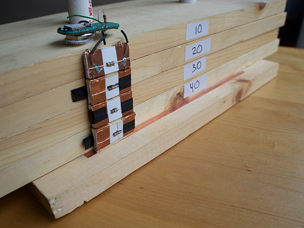
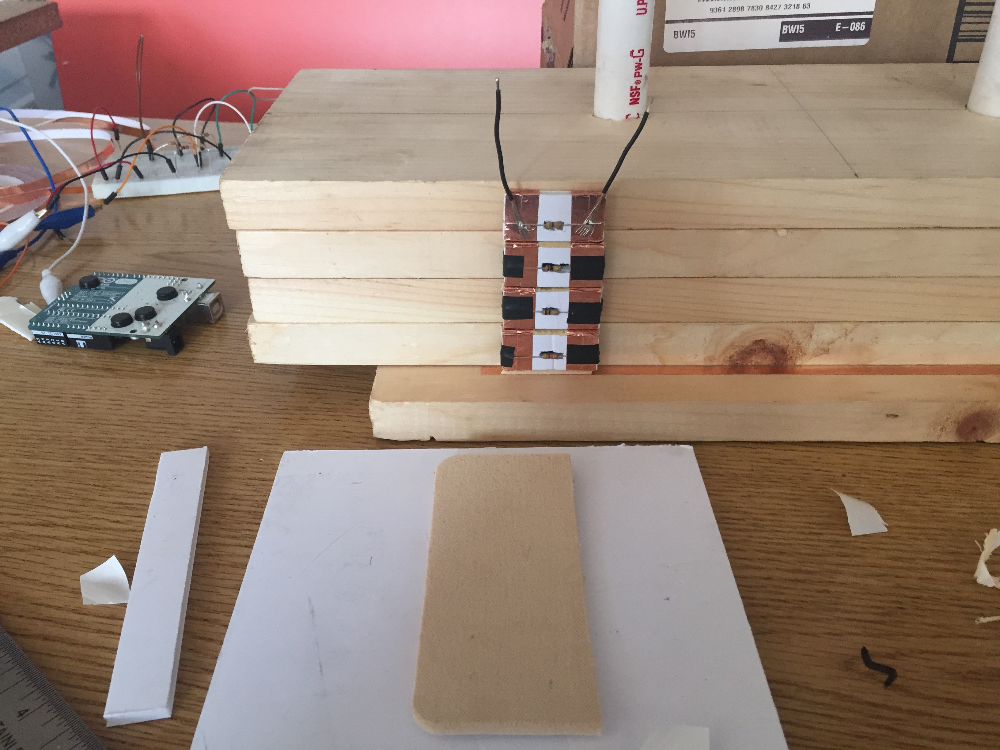
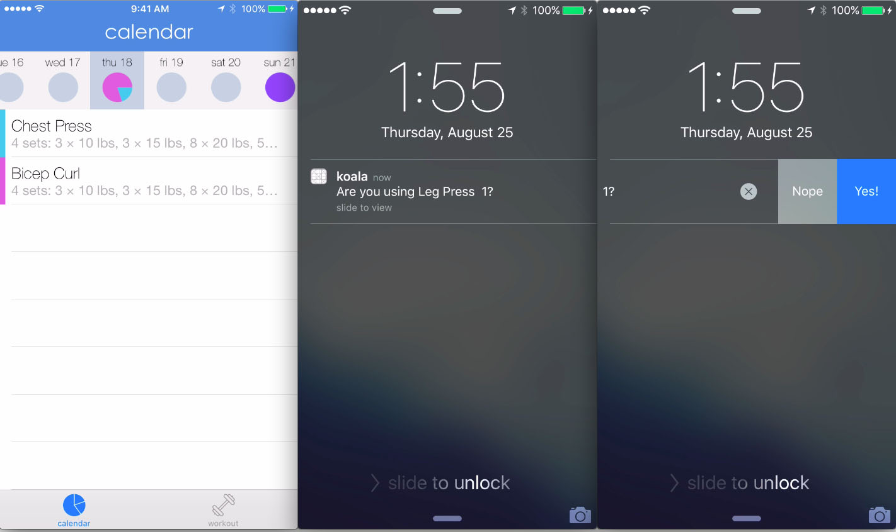

Koala is a project I worked on near the end of college that aimed to bring fully automatic workout tracking to health clubs. The idea came from the proliferation of wearable fitness devices that count steps and track exercises like running while requiring almost no user input. Health club members that lift weights or use cardiovascular equipment, on the other hand, have to manually enter the data from their workout. This may not seem like such an inconvenience, but when you think about someone running on the treadmill at many different speeds and incline levels over a period of time, or doing several sets of weightlifting, each time with a different weight and number of repetitions, entering the data manually becomes prohibitively cumbersome.

  

My solution was to build a device that would remain attached to a particular piece of equipment, track all of the workouts performed on it, and transmit the data to whomever was using it at a given time. I prototyped a version of the device that would augment a weight machine, and built a small wooden model of a weight machine for testing. The device attaches itself to the top weight in a stack of weights and uses an accelerometer to detect when the weights are lifted. It also uses a small amount of circuitry attached to each of the weights below it to determine, for each repetition, how many weights have been lifted. The circuitry attached to each weight is supported by foam inserts that ensure that each weight, even if slightly misaligned, will maintain reliable electrical contact with its neighbors.

<figure>
	
</figure>

At the top of the weight stack, next to the accelerometer, is a bluetooth-enabled microcontroller that transmits workout data whenever the user requests it via a companion iOS app. I prototyped a simple version of the app with only a calendar page for viewing prior workouts and the bluetooth protocol for receiving and processing workout data. As part of the design intent that workout tracking should require as little of the user's time and effort as possible, I made sure that all data collection could be done without even unlocking the iPhone.

<figure>
	
</figure>

