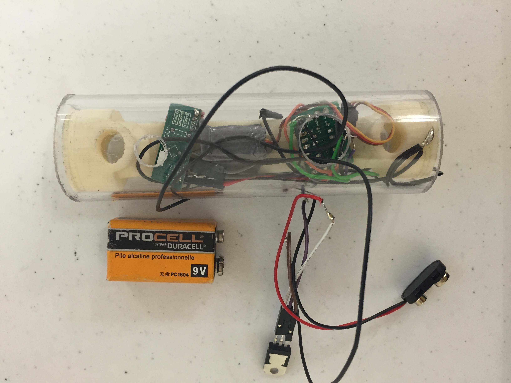

For my senior design project as an undergraduate at JHU, I worked on a team of four to design a new bike lock for Kryptonite. At the outset of the project, Kryptonite explained that our goal was to create a bike lock that would be easier to use while bending over with your bike packed tightly into a crowded rack. 

<figure>
	
</figure> 

	

Our team prototyped a purely mechanical design that reimagined all of the basic mechanisms inside the lock, and an electronic "smart" lock. My role in the design process was mostly the design of the circuitry and firmware inside the electronic lock. Pictured above is one of our early prototypes that used acrylic tubing and a 3D-printed housing to interface the locking mechanism with the electronics. Our final design is the sole property of Kryptonite.

