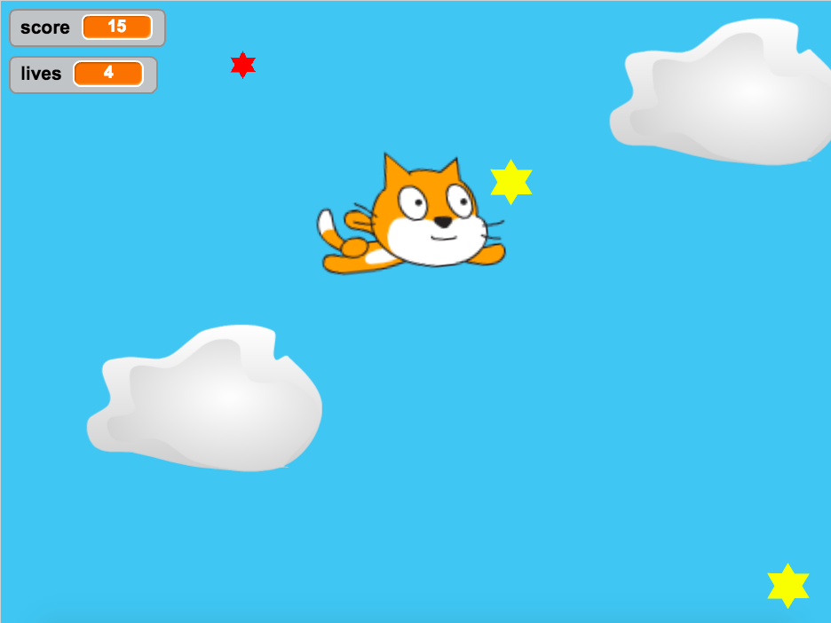

As part of my work with WHEDco, I use the Scratch programming language to introduce elementary and middle school students to programming and computer science. One of the best teaching methods I have found is to take simple games - mostly classic arcade games or newer, popular game apps - and program even simpler versions on Scratch. Usually I'll spend a few weeks on a game, each day showing the students how to implement one small component and letting them try it out themselves. The WHEDco Scratch account has all the games I've created for my classes, or you can check out my version of asteroids below (you'll have to allow Flash to play).

<iframe allowtransparency="true" width="485" height="402" src="//scratch.mit.edu/projects/embed/187690901/?autostart=false" frameborder="0" allowfullscreen></iframe>

Note - this game is too advanced for middle schoolers, but I still like to show it to my students for inspiration.

