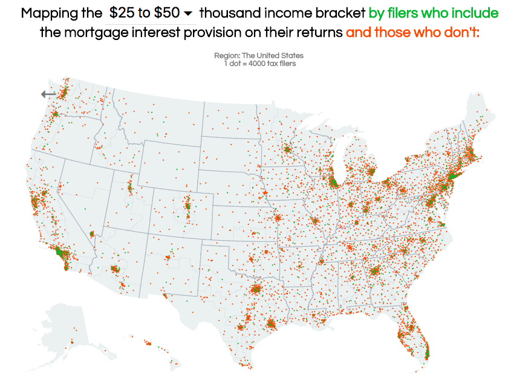

SearchTaxData is a web app that uses IRS data to visualize the various provisions in the federal tax code, and the taxpayers around the nation that are credited or penalized by them. The creation of the app was motivated by the Tax Cuts and Jobs Act (TCJA), which was passed by congress and signed into law by President Trump in December 2017. TCJA adjusts, alters, or eliminates many existing provisions, so the goal of SearchTaxData was to help explain the impact those changes will have by illustrating, for each provision, where its users are located and how wealthy they are. Use the web app <a id="link" href="http://www.searchtaxdata.com/">here</a>.

The app is built with <a id="link" href="http://flask.pocoo.org/">Flask</a>, and all graphics were created with <a id="link" href="https://d3js.org/">D3</a>. The map contains two overlaid dot density maps - one for people who use a tax provision, and one for people who don't - and dynamically recreates them when a new tax provision is chosen or the user zooms in or out to a different region. The region can be any congressional district or state, or the entire nation. The engine behind the dot density mapping is <a id="link" href="https://github.com/ubilabs/kd-tree-javascript">Ubilabs' javascript kd tree implementation</a>.

